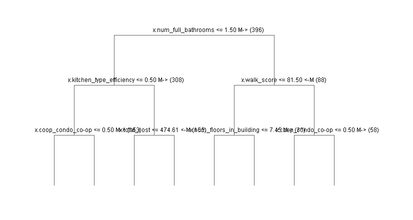
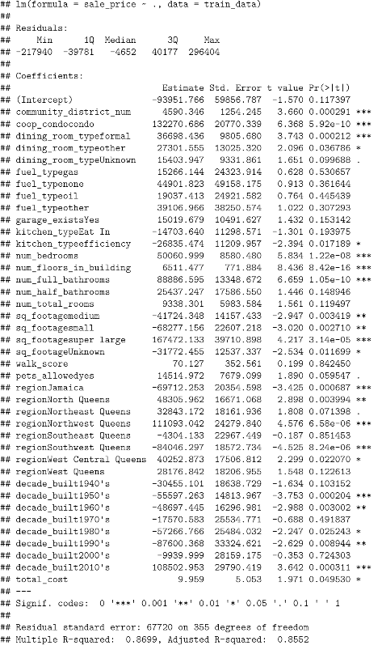

Predicting Housing Prices in R

Final project for Math 342W Data Science at Queens College

5/25/2021

By Jacob Minkin

**Abstract**

We can build models to predict anything. We use models to predict the weather, how long your commute will be, and even how long you will live. Making a model is easy. Making a good model is not. Models can reinforce false notions on how the world works. We should never be too confident in our knowledge and be extra skeptical when our model agrees with our preconceived notions. When approaching a phenomenon, we must first explain if it is something that can be properly modeled. We must understand the scope of the model and how that impacts its predictive capabilities. This project uses methods from the class to model real life housing prices. Housing prices should be a prime example of the power of modeling because the price of houses is controlled by humans. A lot of the factors that are used by the buyers and sellers are public, so our model should be very accurate. That being said, there are still a lot of traps that we can fall into.

1.  **Introduction**

    Predictive models should be good at predicting housing prices. These are mathematical models that are trained from past data and used to predict future events. Housing prices should be easy to predict because we have most of the data that homeowners will use to decide how much they are willing to spend. One thing you must worry about is the time frame. Over long periods of time, you need to account for inflation and other changes that may have taken place. This data was collected in Queens over one year from February 2016 to February 2017. This means that this model is best suited for predicting the sale price of houses in queens sold between February 2016 and February 2017. The model predicts the amount of money that someone paid to buy a condo or co-op in dollars.

2.  **The Data**

    This data was harvested from MLSI and contains condos and co-ops sold between February 2016 and February 2017. The maximum price was set to one million dollars. This could lead to extrapolation if anyone tried to use this model on a house that costs more than that. This is a real problem because housing is very expensive in Queens and there are many houses that cost more than a million dollars. This model should only be used if your target price range is less than one million dollars.

    **Featurization**

    There are 528 observations.

| Name of feature           | Details                                                                                                                                                                                                                                                                                                                                                                                                                                                                |
|---------------------------|------------------------------------------------------------------------------------------------------------------------------------------------------------------------------------------------------------------------------------------------------------------------------------------------------------------------------------------------------------------------------------------------------------------------------------------------------------------------|
| Community district number | Nominal feature that is between 3 and 32. This is the district of the condo/co-op. 25 percent of the data is in district 25. 21 percent is in district 26. 23 percent is in district 28. 25 percent is roughly split between districts 24, 27 and 30. The rest are scattered around with roughly 88 percent of the cases in districts 24-30. This feature was given in the raw data.                                                                                   |
| Co-op or Condo            | Nominal feature that is either co-op or condo. 76 percent are co-ops while the other 24 percent are condos. This feature was in the raw data.                                                                                                                                                                                                                                                                                                                          |
| Dining room type          | Nominal feature with 4 levels. 45 percent have combo dining room and living room. 22 percent have formal dining rooms. 9 percent have a different type of dining room. All missing dining rooms were casted as “Unknown”. This feature was given except that I combined the response “dining room” and “formal” into one level.                                                                                                                                        |
| Fuel type                 | Nominal feature with 5 levels. This is the type of heating the building has. Electric is 2 percent. Gas is 57 percent. None is .5 percent. Oil is 34 percent. Other is 1 percent. The rest are NA and are imputed. This feature was given in the raw data.                                                                                                                                                                                                             |
| Garage exists             | This is a nominal variable that is either yes or no. it is 82 percent No. This feature was given in the raw data where all Na’s were converted to no.                                                                                                                                                                                                                                                                                                                  |
| Kitchen Type              | Nominal feature with 3 levels. Combo is 15 percent. Eat in is 40 percent. Efficiency is 44 percent. This feature was given in the raw data.                                                                                                                                                                                                                                                                                                                            |
| Number of bedrooms        | Nominal feature with 4 levels. 0 bedrooms is 5 percent. 1 bedroom is 46 percent. 2 bedrooms is 39 percent. 3 bedrooms is 10 percent. This feature was given in the raw data.                                                                                                                                                                                                                                                                                           |
| Number of floors          | A nominal feature that goes from 1 to 34. This is how many floors are in the building where the home is located. 64 percent of the buildings have between 1 and 7 floors with 6 floors being the most common. This feature was given in the raw data.                                                                                                                                                                                                                  |
| Number of bathrooms       | Nominal feature that goes from 0 to 3. 5 percent have 0 bathrooms. This probably means that they share a bathroom for the floor. 46 percent have 1 bathroom. 39 percent have 2 bathrooms. 10 percent have 3 bathrooms. This feature was given in the raw data.                                                                                                                                                                                                         |
| Number of total rooms     | Nominal feature that goes from 1-8. .5 percent is 1 room. .5 percent is 2 rooms. 33 percent is 3 rooms. 4 rooms is 29 percent. 5 rooms is 20 percent. 6 rooms is 9 percent. 7 rooms is 2 percent. 8 rooms is .5 percent. This feature was given in the raw data.                                                                                                                                                                                                       |
| Square footage            | This is a nominal feature with 5 levels. This is the size of the home broken up into levels. Small is between 100 to 600 square feet and is .4 percent. Medium is between 601to 900 square feet and is 23 percent. Large is between 1000 and 1800 square feet and is 12 percent. Super Large is more than 1800 square feet. This is .15 percent of the data. The rest were set to unknown. This feature was given in the raw data as integers, and I set it to levels. |
| Pets allowed              | Nominal variable that is either yes or no. 54 percent no to 46 percent yes. This is a combination of 2 raw features cats allowed and dogs allowed. If even one pet was allowed, I set pets allowed to yes.                                                                                                                                                                                                                                                             |
| Region                    | Nominal variable with 9 levels. Central Queens (6.4%), Jamaica (6.4%), North Queens (21.4%), Northeast Queens (13.6), Northwest Queens (3.8%), Southeast Queens (6.4%), Southwest Queens (11.1%), West Central Queens (17.6%), West Queens (13.1%). This feature was made from the zip codes of the address of the homes.                                                                                                                                              |
| Decade built              | This is a nominal variable with 10 levels. The approx. year built was in the raw dataset.                                                                                                                                                                                                                                                                                                                                                                              |
| Total cost of living      | This is a continuous variable. This is cost of living in that home which a combination of taxes and maintenance cost. There is also a percent off discount that was removed from the cost. The mean cost is \$928, while the standard deviation is \$1288. Costs range from \$11 to \$9640. The cost was calculated differently for condos and co-ops. Condos were mainly calculated from taxes, and co-ops from maintenance cost.                                     |

**Errors and Missingness**

In a few places in the data, there were obvious errors. Some of the features would be misspelled or some of the observations would be capitalized while others were not. Most of the errors were obvious and I fixed them. Others like having 0 bedrooms I just left them the way they are. I imputed missingness for some features, but I also made missing a level for a lot of my nominal variables. I did not make any dummy variables because I didn’t think it would help significantly.

1.  **Modeling**

    **Regression Tree Modeling**

    ****

    **Linear Modeling**

    The Vanilla OLS model had an adjusted r-squared of 0.8552 with a standard error of \$67720. The features that matter the most are co-op condo and square footage. Northwest Queens and being built in the 2010’s are also big factors. Total cost had very little impact on this model. This model is very good for predicting.

    

    **Random Forest Modeling**

    In theory, Random Forests should give the best model. This is because you are intentionally overfitting trees and finding the average of many trees. This in theory will give you a low bias model. This is also non-parametric. The complexity grows with the size of the data. In this example, we didn’t gain anything, and the Random Forest did slightly worse than the linear model. This is because the linear model did well, which makes me think that this is a linear process. The Random Forest was probably underfit because we only had 396 observations in the training data. I believe that co-op condo and square footage are the two most important features. There is not enough information to prove they are causal because the dataset is small and they cannot be properly analyzed.

2.  **Performance Results for your Random Forest Model**

    The Random Forest Model using YARF had an out of bag R squared of 0.79 and an RMSE of \$81329.65. The out of sample prediction had an R squared of 0.52 and an RMSE of \$ 93058. I don’t think that the out of sample is a valid estimate in this case because of the high variability of the test data. I tried re-building the model with different splits and I got similar out of bag statistics and much better out of sample statistics. If cross validation were done, I would expect the out of sample to equal the out of bag statistics. This is because the bagging is acting as a cross validation for the model.

3.  **Discussion**

    The linear model did better than the Random Forest. This makes me think that housing prices are linear. If that is the case, I would expect square footage to be the biggest causal driver. Of course, this depends on where builders decide to build large houses. A lot of the major features in the linear model focus on size of the house. Square footage would be a larger factor except that the data was mostly missing, and I was required to make it into a nominal feature. What surprised me the most was how little total cost mattered in the linear model. This may be because I messed up my calculations for this feature. I am not an expert in real-estate, so these numbers do not mean much to me. Also, community district was not important. Region probably included most of the information that was contained in community district. It could also be that I didn’t cast it as a factor. I don’t think this model is production ready because of its limitations of houses that are less than one million dollars. According to [neighborhood scout](https://www.neighborhoodscout.com/ny/queens/real-estate), 10 percent of homes are valued greater than one million dollars in 2021. This severely limits the model. I also think that there is a lot more work to be done on the features. One feature I would add if I had more time would be a ratio of full bathrooms to bedrooms. I expect that would be a significant improvement.
